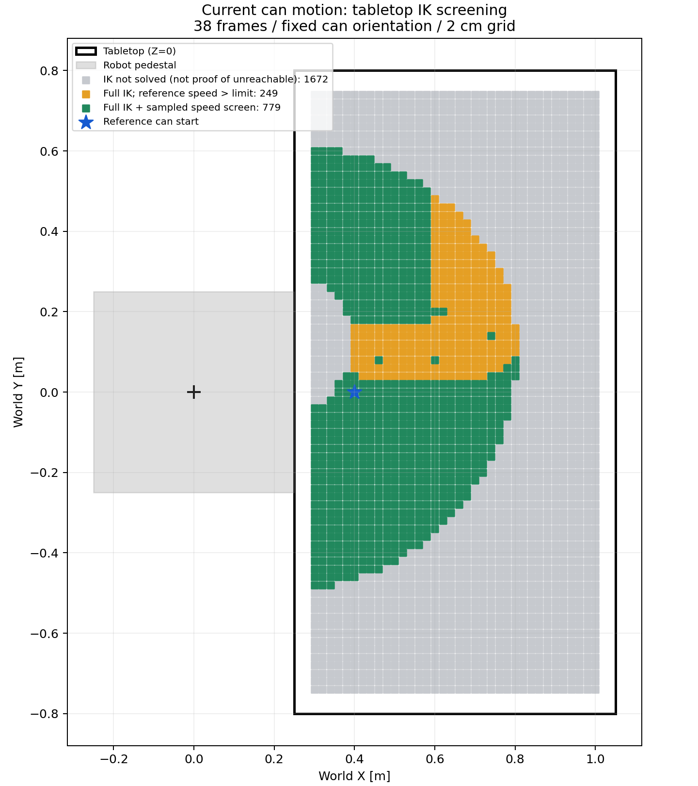
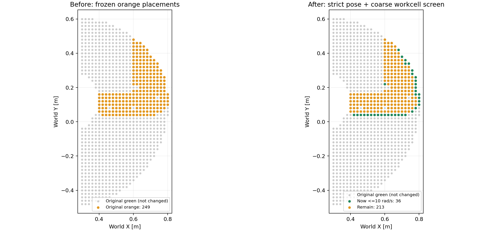
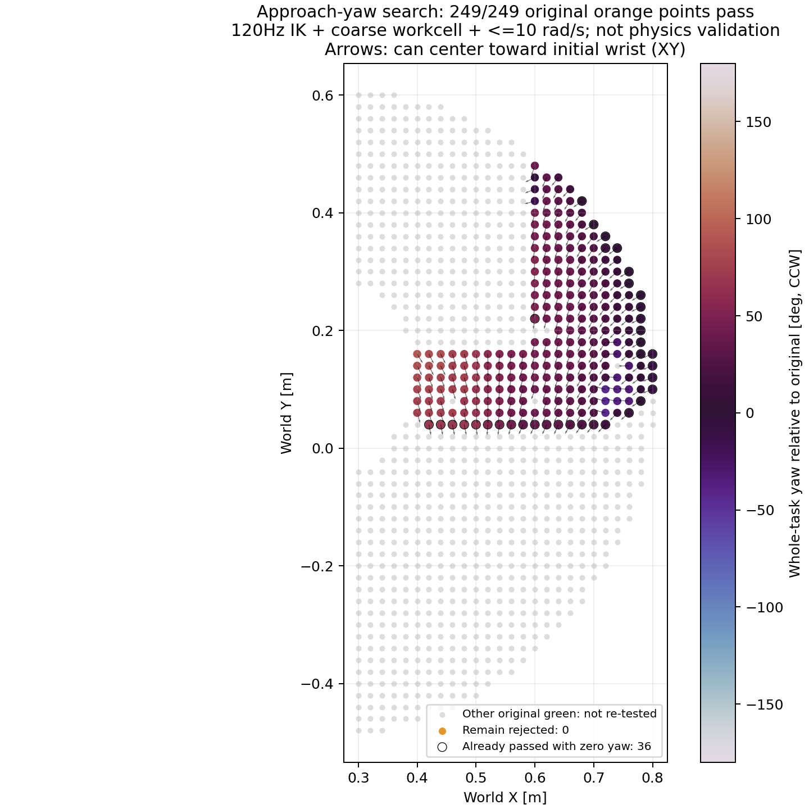
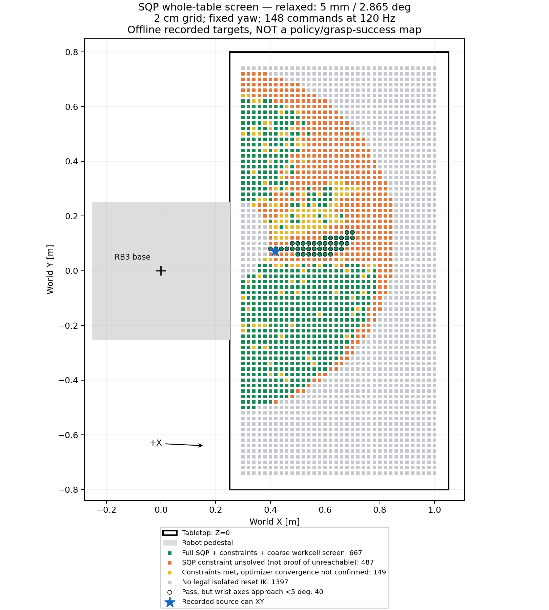
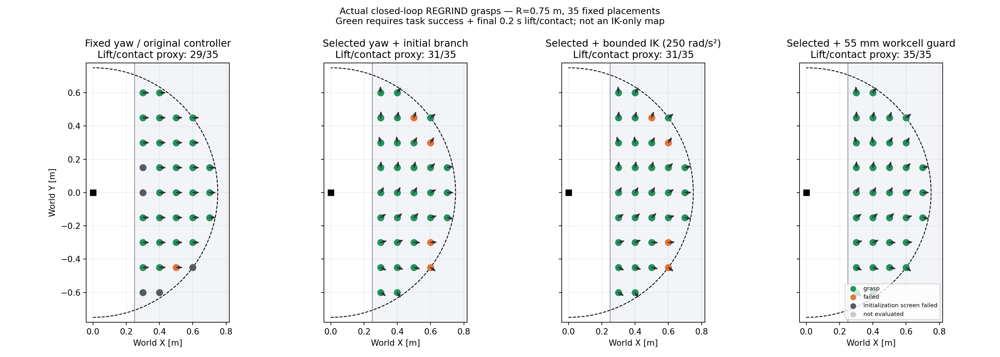

# 현재 캔 파지 동작의 책상 위 영역: IK 조사와 실제 정책 평가

최초 측정일: 2026-09-10. 아래 최초 조사는 **실제 물리 파지 성공 영역이 아니라, 현재 reference를
평행 이동한 전체 궤적의 기구학적 후보 영역**이다. 정책·컨트롤러·기본 랜덤
배치 범위는 변경하지 않았다.

후속 실험: [고정 방향의 branch 비교](#주황-영역의-관절-급변-개선-실험),
[캔 위치별 접근 방향 선택](#캔-위치별-접근-방향-yaw-선택),
[책상 전체 SQP 조사](#2026-09-15-책상-전체-sqp-조사),
[반원 영역 실제 closed-loop 파지 평가](#2026-09-15-반원-영역-실제-파지-평가).

## 실제 측정 결과

책상 가장자리에서 캔 footprint 여유를 제외한 X=0.30~1.00m,
Y=-0.74~0.74m의 **2cm 격자 2,700곳**을 계산했다. 6 CPU worker로
약 121초가 걸렸다. 사전 5cm 조사(465곳)도 별도 폴더에 보존했다.

| 판정 | 배치 수 |
|---|---:|
| 전체 38프레임 strict IK 통과 | 1,028 |
| 위 조건 + 관절 차분 속도 ≤10rad/s | 779 |
| 전체 IK 통과하지만 차분 속도 초과 | 249 |
| 하나 이상의 frame에서 strict IK 미해결 | 1,672 |

통과점의 외곽은 **X=0.30~0.80m, Y=-0.48~0.60m**이다.
이는 50×108cm 직사각형 전체가 가능하다는 뜻이 아니다. 아래 지도의 색을
기준으로 판단해야 한다. 특히 Y≈+0.10m에는 IK 자체는 통과하더라도 빠른
관절 변화가 필요한 것으로 계산되는 띠가 있다. 이번 계산만으로 해당 띠
전체가 같은 특이점 원인이라고 확정하지 않는다.

초록 격자만으로 채워진 가장 큰 축 정렬 사각형 중 하나는
**X=0.30~0.60m, Y=-0.34~-0.04m**이며 16×16=256개 표본이 통과했다.
이 역시 물리 평가 전의 후보이며, 표본 사이 연속 구간까지 보장하지 않는다.
격자 수×간격²로 계산한 거친 면적 추정은 전체 IK 약 0.411m²,
속도 선별까지 통과한 부분 약 0.312m²다. 정확한 연속 작업공간 면적은 아니다.



[배치별 CSV](../outputs/diagnostics/tabletop_region_20260910_fine/placements.csv),
[설정·결과 JSON](../outputs/diagnostics/tabletop_region_20260910_fine/summary.json).
생성 결과는 로컬 보존 파일이며 clone만 한 환경에서는 재측정해야 할 수 있다.

## 입력과 판정

- 기준 동작: `20200709_143747_left`,
  `outputs/isaac/dexycb/20200709_143747_left/rb3_revo2_reference_stable.h5`.
  38프레임, 30 Hz, 원래 캔 시작 XY=(0.40, 0.00)m.
- 책상: `config/workcell/rb3_revo2_table.json`. 상판 Z=0,
  X=[0.25, 1.05]m, Y=[-0.80, 0.80]m. 로봇 설치점=(0, 0, -0.02)m.
- 마운트: 기존 `rb3_model.json`의 link6→Revo2 base 변환 그대로 사용.
  연결부를 다시 추정하거나 두 번 적용하지 않았다.
- 기존 reference loader로 quaternion을 XYZW로 해석. 이 파일에서는
  `target_wrist_*`와 `wrist_*`가 수치상 동일함을 확인했다.
- 캔의 초기 방향과 높이, 동작 중 회전 및 상대 궤적은 유지한다.
  각 격자의 캔 시작 XY와 기존 시작 XY의 차이만 손목 궤적 전체에 더한다.
- 실제 tuna mesh를 초기 방향으로 회전한 XY footprint를 사용하여,
  초기 캔 전체가 상판 안에 들어오는 격자만 검사한다. 캔 중심만 책상 안에
  있는 경우를 통과시키지 않는다. footprint는 중심에서 약 ±4.3cm이다.
- 검증된 `RB3730Kinematics`와 `WarmStartIK` 재사용. 관절 제한 유지,
  위치 오차 ≤0.1mm, 회전 오차 ≤0.001rad, `max_nfev=500`.
  첫 seed는 reference 첫 RB3 관절각, 이후는 이전 IK 해이다.
- **초록**: 38프레임 전체 strict IK 통과 + 계산된 관절 차분 속도 ≤10rad/s.
  **주황**: 전체 IK 통과하지만 차분 속도가 10rad/s 초과.
  **회색**: 주어진 seed/반복 예산에서 전체 IK를 풀지 못함.
  회색은 수학적으로 도달 불가능하다는 증명이 아니다.
- 속도는 `diff(q)/reference_dt`이며 임의로 각도를 wrap하지 않는다.
  10rad/s는 현재 arm config의 속도 한계를 이용한 **후보 선별 기준**일 뿐,
  저속·저가속·안정 파지 또는 실물 안전 속도를 뜻하지 않는다.

## 재현 및 출력

저장 폴더가 이미 있으면 덮어쓰지 않고 오류를 낸다. 재측정 시 새 이름을 쓴다.

```bash
OPENBLAS_NUM_THREADS=1 OMP_NUM_THREADS=1 \
/home/wanjunkim/IsaacLab/.venv/bin/python \
  -m tools.arm_diagnostics.measure_tabletop_region \
  --reference outputs/isaac/dexycb/20200709_143747_left/rb3_revo2_reference_stable.h5 \
  --out outputs/diagnostics/tabletop_region_20260910_fine \
  --spacing 0.02 --workers 6
```

각 실행 폴더:

- `tabletop_region.png`: 로봇 받침대/책상/XY 후보 지도.
- `placements.csv`: 배치별 전체 통과 여부, 최초 실패 frame, 오차, 관절 여유, 속도.
- `solutions.npz`: XY, 계산된 관절 해, pose 오차 및 판정 배열.
- `summary.json`: 입력 hash, 배치/시간/허용오차/geometry 및 결과 요약.

실패 배치는 최초 실패 frame에서 중단한다. 이후 NPZ의 NaN은 미검사 표시이며,
시뮬레이터 NaN 발생을 뜻하지 않는다. CSV의 최대 오차도 검사한 frame에 한정된다.

## 해석의 한계

이 지도의 초록점에서도 아직 **충돌, 손끝 접촉, actuator 추종, 파지 성공**을
검증하지 않았다. 손·팔과 책상/받침대의 간섭, 캔과 손가락의 접촉, 초기 접근
동작은 검사 범위 밖이다. 캔 footprint 검사는 초기 XY 배치에만 적용된다.

또한 30 Hz reference 표본을 검사했으며, 현재 controller의 120 Hz 필터/IK
사이 경로를 실행한 것이 아니다. 정책 residual, 실제 관측에 따른 정책 변화,
물체를 놓친 후의 행동도 포함하지 않는다. 특정 reference가 통과한다고
그 위치에서 closed-loop RL 동작까지 통과한다고 할 수 없다.

외곽 X/Y 최소·최대는 통과점들의 바깥 경계일 뿐, 그 직사각형 전체가
통과하는 것은 아니다. 내부에도 관절 branch/특이점/수치 풀이에 민감한 곳이
있다. 초록 영역을 실제 랜덤 배치 범위로 채택하기 전에는 동일 정책/제어기로
물리 평가해야 한다. 이번에는 기본 배치 범위를 확장하지 않았다.

## 검증

`./scripts/run_tests.sh`: 새 측정 계약 테스트 2개를 포함해 144개 통과.
새 테스트는 mounted-wrist의 XY 이동/FK 일치와 미검사 frame 표시를 검증한다.
또한 저장된 성공 배치의 39,064개 관절 해를 FK로 다시 계산했다.
모두 finite이고 관절 제한 안이며, 최대 위치 오차 7.104e-6m,
최대 회전 오차 4.984e-4rad로 설정된 strict 허용오차를 만족했다.
실제 측정은 headless CPU IK 계산이며 Isaac 접촉 시뮬레이션을 수행한 것으로
보고하지 않는다. 기존 테스트의 일부 파일 핸들 ResourceWarning은 남아 있다.

관련 코드: [측정 도구](../tools/arm_diagnostics/measure_tabletop_region.py),
[회귀 테스트](../tests/test_tabletop_region.py),
[팔 제어 구조와 기존 한계](ARM_CONTROL_HISTORY_KO.md).

## 주황 영역의 관절 급변 개선 실험

같은 날, 위 지도에서 주황색이었던 **249개 배치를 고정**하여 비교했다.
기존 초록/회색 배치는 변경하지 않았다. 기존 FK/IK와 Jacobian을 재사용하고
정책, 제어 gain, 속도·위치 한계, 손목 target, 동작 시간을 변경하지 않았다.
위치 0.1mm / 회전 0.001rad 기준도 그대로 유지했다.

### 비교한 방법

1. **Local continuation**: 이전 해 하나에서만 기존 IK를 실행하여 fallback의
   다른 해 선택 영향을 분리했다. 초기 해는 baseline과 동일하다.
2. **다중 초기 자세**: 첫 pose를 서로 다른 seed에서 풀고, 각 해에서 전체
   동작을 이어 푼 뒤 최대 관절 속도가 가장 작은 궤적을 고른다.
3. **양방향 후보 그래프**: 첫/마지막 pose에서 앞·뒤로 푼 해를 모아,
   표본 간 최대 관절 변화가 최소인 연결을 선택한다. 같은 최댓값이면
   관절 변화 제곱합을 줄인다. 부분 성공 경로는 유효한 pose만 후보로 쓰며,
   부분 경로 자체를 전체 성공으로 세지 않는다.
4. **기존 VelocityBoundedIK**: 선택한 초기 해에서 ±10rad/s의 관절 이동
   상자 안에서 기존 IK를 시도한다. pose 오차 기준을 넘으면 채택하지 않는다.
   근사 해를 얻었다는 이유만으로 strict 성공으로 바꾸지 않는다.

첫/마지막 pose 각각 24개 seed로 예비 실행하고, 각각 64개로 늘린 전체 비교를
수행했다. 이 두 예산에서 30Hz 최종 통과 수는 모두 44곳이었다. 무한 탐색이
아니며 모든 IK branch를 찾았다는 보장은 없다. `q`를 modulo로 감싸서 실제
관절 움직임을 숨기지 않는다. 초기값으로 서로 다른 회전 수의 유효한 관절각을
찾을 수는 있지만, 그 값 자체에 기존 관절 제한을 적용한다.

### 중요한 발견: 쉬운 IK 해가 모두 쓸 수 있는 자세는 아니다

장애물을 고려하지 않고 다중 초기 자세만 선택하면 249곳 모두 최대 속도를
3.744rad/s 아래로 낮출 수 있었다. 그러나 이들 궤적의 대부분은 팔의 중심선이
**로봇 받침대 또는 책상 내부를 지나갔다**. 예를 들어 XY=(0.42, 0.04)m의
한 저속 후보는 팔꿈치 초기 Z가 약 -0.138m로 받침대 안쪽에 들어갔다.
이러한 결과를 채택 가능한 개선으로 보고하지 않았다.

공유 workcell의 실제 pedestal/상판/다리 AABB와 shoulder→elbow→wrist→mounted
wrist 중심선의 교차를 검사하여 명백한 간섭 후보를 제외했다. 고정된 base의
정상 장착 구간은 제외한다. **로봇 두께, mesh, 자기충돌, 연속시간 충돌은
검사하지 않은 간단한 선별 검사**다. 이 검사만으로 collision-free라고 부르지 않는다.
원래 주황색 baseline 중에도 1곳이 이 추가 검사에 걸렸다.

### 30Hz 동일 표본 비교 결과

| 방법 | 전체 strict pose 통과 | 중심선 선별까지 통과 | 속도 ≤10rad/s까지 통과 |
|---|---:|---:|---:|
| 원래 주황 baseline | 249 | 248 | 0 |
| 같은 초기 해 + local continuation | 224 | 224 | 0 |
| 다중 초기 자세 중 최소 속도 해, 장애물 미고려 | 249 | 16 | 16 |
| 중심선 선별 + 양방향 후보 선택 | 249 | 249 | 37 |
| 기존 속도 제한 IK 시도 | 44 | 249 | 44 |
| strict/중심선 기준 만족 후보 중 최종 선택 | 249 | 249 | **44** |

속도 제한 IK에서 나머지 205곳은 느리게 만들 수 있어도 target 오차가 커져
탈락했다. 이 시도의 최악 오차는 3.726mm / 0.16860rad였다. 최종 선택에서는
이 탈락 해 대신 strict 기준을 만족하는 다른 후보를 유지했다.

30Hz 최종 선택의 결과:

- 배치별 최대 속도가 감소한 곳 125, 사실상 동일한 곳 124, 증가한 곳 0.
- 전체 최대 step: **3.10232 → 1.58296rad**, 약 49.0% 감소.
- 전체 최대 속도: 93.0697 → 47.4887rad/s. 여전히 큰 값으로, 모든 배치를
  실제 제어에 사용할 수 있다는 결과가 아니다.
- 배치별 최대 속도 중앙값: 19.7908 → 15.5319rad/s.
- 최대 가속도: 3086.12 → 2152.62rad/s². 배치별 가속도는 120곳 감소,
  **4곳 증가**했으므로 속도 개선을 곧바로 전체 안정성 개선으로 해석하지 않는다.
- 최종 선택의 최대 pose 오차: 0.01979mm / 0.00096767rad, 기존 strict 기준 안.
- XY=(0.76, 0.30)m: 최대 step **2.85318 → 0.091736rad**,
  속도 85.5955 → 2.75208rad/s, 가속도 2866.65 → 47.5842rad/s².

이 결과를 120Hz로 보간한 동일 손목 경로에서 **첫 자세만 선택해 local IK로
이어 가는 경우**를 별도로 재검사하니, 새 초기 자세의 통과는 34/249였다.
전체 strict 경로가 풀린 수는 baseline 초기 자세 229, 새 초기 자세 239였다.
각 조건에서 완주한 경로의 최대 속도는 172.16→176.35rad/s,
가속도는 28092.6→37561.7rad/s²였다. 완주 집합도 다르며 이 최악값을 개선으로
보고하지 않는다. 즉 **30Hz 표본의 개선이 120Hz 전체 실행의 개선을 보장하지
않는다**. 이를 확인하고 120Hz 표본 자체를 대상으로 후보 선택을 추가 수행했다.

### 최종 120Hz 후보 선택 결과

첫/마지막 각각 24개 seed, 149개 pose를 사용하여 약 223초간 계산했다.
같은 시작 자세의 local continuation baseline은 229/249곳에서 끝까지 strict
pose를 풀었고, 추가 후보 선택은 249곳의 각 표본에서 strict pose를 찾았다.
그러나 **속도와 중심선 검사까지 통과한 최종 후보는 36/249곳**이다.
나머지 213곳은 여전히 실행 가능 후보로 채택하지 않는다.

완주 여부 차이로 인한 착시를 피하기 위해, 아래는 **baseline이 완주한 동일
229개 배치만** 맞춘 비교다. 나머지 20개는 baseline 실패로 따로 남겼다.

| 120Hz 지표, 동일 229곳 | 기존 초기 자세/연속 IK | 후보 선택 |
|---|---:|---:|
| 전체 최대 관절 속도 [rad/s] | 172.158 | 125.725 |
| 전체 최대 관절 step [rad] | 1.43465 | 1.04771 |
| 배치별 최대 관절 속도 중앙값 [rad/s] | 21.8754 | 17.0208 |
| 전체 최대 가속도 [rad/s²] | 28092.6 | 11789.5 |

속도 감소 107곳, 차이 <1e-6rad/s인 곳 122, 증가 0.
가속도는 **4곳에서 증가**했다. 최고 속도와 가속도는 아직 큰 값이므로
남은 후보들을 안정된 실행 궤적처럼 사용하지 않는다.

36개 통과 후보는 기존 완주 집합에서 33개, baseline 미완주 20개 중 3개다.
이 36개에 한정하면 최대 속도 ≤10rad/s, step ≤0.083334rad이다.
하지만 최대 가속도는 약 **790.87rad/s²**이며, 가속도/jerk 및 실제 actuator
추종까지 통과한 궤적이 아니다. 추가 시험용 후보라는 의미다.

대표적으로 XY=(0.72, 0.36)m:

- 최대 step: **0.93481 → 0.020418rad**.
- 최대 속도: **112.177 → 2.45014rad/s**.
- 최대 가속도: **7342.31 → 139.240rad/s²**.
- 같은 world 손목 pose, 같은 시간축, 같은 mount와 관절 제한을 사용했다.

**실패 결과도 보존:** baseline이 완주하지 못했던 20개 중 일부를 후보
그래프로 이어 붙이면, 각 pose는 맞아도 중간 step이 최대 5.456rad,
속도가 654.75rad/s인 부적절한 연결이 나온다. 이는 `paths.npz`의
`selected`에도 분석용으로 남아 있으므로 **그 배열 전체를 실행 명령으로
사용하면 안 된다.** `comparison.csv`에서 `method=selected`이고
`screened_pass=True`인 36개만 다음 검증 후보로 취급한다. 임의 wrap이나
pose 오차 허용으로 이 실패를 감추지 않았다.

최종 선택 전체의 pose 오차는 최대 0.004231mm / 0.00019785rad로 strict
기준 안이다. 하지만 이것이 관절 속도 실패를 상쇄하지 않는다.



왼쪽은 원래 주황 249곳, 오른쪽 초록은 이번 120Hz 선별 통과 36곳이다.
배경 회색은 원래 초록점으로 이번 비교에서는 변경/재검사하지 않았다.
[120Hz 배치별 값](../outputs/diagnostics/tabletop_branches_20260910_optimized120/comparison.csv),
[30Hz 배치별 값](../outputs/diagnostics/tabletop_branches_20260910_final/comparison.csv),
[120Hz 관절 그래프](../outputs/diagnostics/tabletop_branches_20260910_optimized120/worst_placement_joints.png).

### 남은 급변의 근거와 한계

초기 자세 변경이 실제로 크게 도움이 되는 배치가 있다는 사용자 관찰은
일부에서 확인됐다. 그러나 모든 배치의 해결이 확인된 것은 아니다.
남은 예인 XY=(0.52, 0.08)m의 30Hz 선택 경로에서는 frame 30→31에
손목 위치가 10.295mm, 방향이 0.02006rad 변할 때 wrist1/wrist3가
-1.41755 / +1.40962rad 회전한다. wrist2는 -0.928°→+2.851°이고,
이전 frame의 가중 pose Jacobian 최소 특잇값은 0.00754(최대 6.534),
가장 가까운 관절 위치 제한까지 여유는 0.578rad다. 이 예는 단순한 관절 끝
제한보다 **손목 특이점 부근의 민감도**와 부합한다. 모든 남은 배치의
수학적 최적해를 증명한 것은 아니다.

큰 감소가 가능한 다른 팔 자세 다수는 workcell 중심선 검사에 걸렸다.
따라서 현 단계에서 단순히 솔버만 바꾸면 전부 해결된다고 결론낼 수 없다.
정확한 mesh 충돌/접근 경로 검증, 또는 허용 가능한 손목 방향·시간 변경은
다음 별도 작업이며 이번 실험에 섞지 않았다.

### 재현 명령과 저장 위치

기본 시뮬레이터 경로와 분리된 offline 도구다. 아래 폴더는 기존 결과이므로
재실행할 때 `--out`에 새 이름을 사용한다.

```bash
# 249곳 전체: 64 seed, 30Hz reference 그대로
bash scripts/compare_tabletop_branches.sh \
  --scan outputs/diagnostics/tabletop_region_20260910_fine \
  --out outputs/diagnostics/tabletop_branches_20260910_final \
  --seeds 64 --workers 6 --max-nfev 300

# 선택한 초기 자세에서 120Hz로 실제 계속 풀기: 중간 joint reset 없음
bash scripts/compare_tabletop_branches.sh \
  --scan outputs/diagnostics/tabletop_region_20260910_fine \
  --candidates outputs/diagnostics/tabletop_branches_20260910_final/paths.npz \
  --out outputs/diagnostics/tabletop_branches_20260910_dense120 \
  --workers 6 --max-nfev 300

# 120Hz 경로 자체를 보고 초기 자세/branch를 다시 선택
bash scripts/compare_tabletop_branches.sh \
  --scan outputs/diagnostics/tabletop_region_20260910_fine \
  --dense-search-baseline outputs/diagnostics/tabletop_branches_20260910_dense120/paths.npz \
  --out outputs/diagnostics/tabletop_branches_20260910_optimized120 \
  --seeds 24 --workers 6 --max-nfev 300
```

`paths.npz`에 배치 index/XY, 방법별 `(249,N,6)` 관절 경로, timestep을 저장한다.
`comparison.csv`는 배치·방법별 오차/최대 step/속도/가속도/간섭 선별 결과다.
`summary.json`은 입력 hash/예산/시간/방법별 집계다. 30Hz 실행은 N=38,
120Hz 실행은 N=149, 같은 시작/종료 시각 0~1.23333s다. 위치 linear 및 회전
SLERP 보간을 두 조건에 동일하게 적용한다. 실패 후 미계산 부분은 NaN으로
구분하며, 기록을 이전 해로 채워 완주처럼 만들지 않는다.

최초 예비 실행 `tabletop_branches_20260910/`는 계산/CSV/NPZ 저장 후 JSON의
NumPy 정수 직렬화 오류로 종료했다. 자료는 보존했고 타입 변환을 수정한 뒤
`..._final/`에 전체 비교를 다시 실행하여 보고서/그림까지 생성했다.

### 적용 범위

이 방법은 **미래 reference 전체를 보는 offline branch 선택**이다.
새 실시간 IK나 정책 controller를 기본 경로로 넣지 않았다. 캔 배치가 정해진
뒤 사용할 첫 팔 자세의 후보를 제공할 수 있지만, 그 자세로 이동하는 접근
경로, 완전한 mesh 충돌, 실제 actuator와 live policy residual에 대한 평가는
별도 필요하다. 기존 성공한 floating/arm 경로는 그대로 남겨 두었다.

추가한 코드는 `sequence_branch_ik.py`(기존 IK 주변의 offline 후보 선택),
`compare_tabletop_branches.py` 및 root launcher, `test_sequence_branch_ik.py`다.
`validate-regrind-change` 절차로 실행 후 전체 **152개 테스트가 통과**했고,
최종 저장 경로 37,101개 pose의 FK를 다시 계산해 finite/관절 제한/strict pose
기준을 확인했다. `git diff --check`도 통과했다. Isaac/PhysX 실행이나 실제
파지 평가는 이번 비교에 포함되지 않았으며, torque/접촉 안정성도 판정하지 않았다.

## 캔 위치별 접근 방향 yaw 선택

같은 주황색 249개 위치에서 **접근 방향을 선택하면 249/249곳 모두**
120Hz strict IK·10rad/s 속도·간이 workcell 선별을 통과하는 후보가 나왔다.
이는 **249회 실제 파지 성공 결과가 아니다**. 기존 0° 방향의 개선 결과
36/249와 동일 위치·시간·관절 한계에서 비교한 offline 경로 계산이다.
기존 초록/회색 위치는 이번 탐색 범위가 아니다.

### 변환과 탐색 방법

캔의 원래 첫 중심을 `c0`, 배치할 중심을 `c`라 할 때, 한 동작 전체에 고정한
world Z축 yaw `theta`로 다음 rigid transform을 사용한다. 좌표는 m,
quaternion은 XYZW, 양의 yaw는 위에서 볼 때 반시계방향이다.

```text
p_new[t] = c + Rz(theta) @ (p_original[t] - c0)
R_new[t] = Rz(theta) @ R_original[t]
```

즉 손목 위치와 방향을 함께 회전한다. 손목 orientation만 제자리에서 돌리지
않으며, 캔 초기 XYZ와 높이는 유지한다. 이 transform을 손·물체에 동일하게
적용하면 물체 기준 손의 상대 pose가 보존됨을 테스트했다. finger reference와
시간축은 변경하지 않는다. 실제 물체를 reference로 강제 이동시키거나 정책을
실행한 것은 아니며, 여기서 IK에 사용하는 입력은 회전된 reference 손목이다.

1. 전체 249곳에서 30° 간격 12방향, 각 방향에서 12개 초기 seed를 조사했다.
2. 가장 좋은 방향 주변을 ±5/10/15°로 세분화했다.
3. 상위 3개 방향에서 최대 2개 초기 해를 120Hz로 다시 이어 풀었다.
   coarse 표본만 통과한 경로는 채택하지 않았다.
4. 이 단계에서 245/249곳 통과. 남은 4곳만 별도로 5° 간격 72방향,
   주변 ±1/2/3°, 24개 seed, 상위 8개 방향의 dense 검증으로 재탐색했다.
   나머지 245개 결과는 재계산하지 않고 원본 그대로 합쳤다.
5. 최대 관절 속도, 최대 가속도, 속도 제곱합 순서로 후보를 선택한다.
   기존 0° 결과도 후보로 유지한다. 전역 최적해 보장은 아니며 정해진 유한
   탐색 안에서의 선택이다. angle label만 정규화하며 관절 경로는 wrap하지 않는다.

모든 최종 경로는 149 pose, 1/120s 간격, 시간 범위 0~1.23333s이다.
원래 30Hz reference의 위치 linear/회전 SLERP를 사용하며 동작을 느리게
하거나, 관절 제한을 늘리거나, pose 허용오차를 완화하지 않았다.

### 실제 결과

| 지표 | 고정 0° + 이전 branch 선택 | 위치별 yaw 선택 |
|---|---:|---:|
| strict pose + 간이 workcell + 속도 통과 | 36/249 | **249/249** |
| 배치별 최대 관절 속도 중앙값 [rad/s] | 17.6474 | **2.07909** |
| 전체 최대 관절 속도 [rad/s] | 654.749 | **9.51255** |
| 전체 최대 관절 step [rad] | 5.45624 | **0.0792713** |
| 전체 최대 관절 가속도 [rad/s²] | 80584.5 | **411.594** |

왼쪽의 극단값은 이전 보고서에서 **실행 부적합으로 남겨둔 후보 연결**까지
포함한 값이지, 실제 로봇이 측정상 이 속도로 움직였다는 뜻이 아니다.
양쪽 모두 계획된 관절 경로의 유한 차분이다. 최종 선택 yaw는 -45°~+90°다.
기존 통과→실패 0곳, 추가 통과 213곳, 최대 속도 악화 0곳이다.

한 곳, XY=(0.76, 0.08)m에서는 속도가 12.764→9.059rad/s로 감소했지만
최대 가속도가 264.764→325.366rad/s²로 증가했다. 가속도/jerk 기준을 만족한
실제 제어기라고 해석하지 않는다.

앞서 특이점 사례였던 **XY=(0.52, 0.08)m**에서는 **yaw=+60°**를 선택했다.
같은 120Hz 계산에서 최대 속도 **65.8113→1.54823rad/s**, step
**0.548428→0.0129019rad**, 가속도 **3246.90→86.1960rad/s²**였다.
초기 245곳 조사에서 남았던 4곳의 재탐색 결과:

| 캔 XY [m] | 최종 yaw | 최대 속도 [rad/s] |
|---|---:|---:|
| (0.76, 0.12) | +10° | 2.0704 |
| (0.72, 0.28) | +22° | 2.1006 |
| (0.72, 0.30) | +20° | 2.1904 |
| (0.72, 0.32) | +17° | 2.2645 |



색은 원래 동작 대비 task yaw, 화살표는 **캔 중심에서 초기 손목으로 향하는
XY 방향**이다. 회색 배치는 이번에 재검사하지 않았다. 검은 테두리는 yaw=0°
상태에서도 이전 속도 선별을 통과했던 36개 위치다.

### 재현 / 출력

```bash
# 전체 위치: coarse + fine + dense 검증
bash scripts/search_tabletop_yaw.sh \
  --scan outputs/diagnostics/tabletop_region_20260910_fine \
  --zero-yaw outputs/diagnostics/tabletop_branches_20260910_optimized120 \
  --out outputs/diagnostics/tabletop_yaw_20260910 \
  --workers 6 --seeds 12 --max-nfev 300

# 남은 4곳만 더 조밀하게 탐색하고, 기존 결과를 보존한 새 파일로 합치기
bash scripts/search_tabletop_yaw.sh \
  --scan outputs/diagnostics/tabletop_region_20260910_fine \
  --zero-yaw outputs/diagnostics/tabletop_branches_20260910_optimized120 \
  --out outputs/diagnostics/tabletop_yaw_20260910_refined \
  --workers 4 --seeds 24 --max-nfev 300 \
  --only-indices 1571 1857 1893 1929 \
  --coarse-step 5 --refine-step 1 --dense-angles 8 \
  --merge-previous outputs/diagnostics/tabletop_yaw_20260910
```

`--out`은 이미 존재하면 오류를 내므로 재실행 시 새로운 이름을 사용한다.
첫 실행 약 194.5초, 4곳 재탐색 약 29.4초(기존 결과 재검사·병합 포함
약 39.8초)였다. 두 실행 모두 CPU이며 Isaac GPU simulation을 돌리지 않았다.

최종 폴더 `outputs/diagnostics/tabletop_yaw_20260910_refined/`:

- `comparison.csv`: 모든 위치의 before/after, 선택 yaw, pose/속도/가속도/한계.
- `candidates.npz`: 원래 scan index, XY, time, yaw, `q (249,149,6)`,
  회전된 `target_wrist_pos`, `target_wrist_quat_xyzw`, accepted mask.
- `screened_candidates.npz`: 위 기준을 통과한 위치만 담은 별도 배열.
  현재는 249곳 모두 통과하여 동일한 크기다. 일반 replay loader용 파일은 아니다.
- `summary.json`: 결과·입력 hash·탐색 조건·이전 결과/재탐색 index 출처.
  병합 결과의 새 탐색 조건은 4곳에 적용된 것이고 나머지는 이전 12-seed 결과다.
- `search_records.json`, `yaw_region.png`, `speed_comparison.png`.

[위치별 수치](../outputs/diagnostics/tabletop_yaw_20260910_refined/comparison.csv),
[요약](../outputs/diagnostics/tabletop_yaw_20260910_refined/summary.json).

### 검증과 아직 하지 않은 것

`validate-regrind-change` 절차로 전체 **158개 테스트 통과**, diff check 통과.
저장된 37,101 pose를 독립적으로 FK 재계산하고 yaw transform과 대조했다.
모두 finite/기존 joint limit 안이고 최대 위치 오차 3.359e-12m,
회전 오차 2.336e-11rad, 실제 저장 경로 차분 속도 최대 9.51255rad/s였다.

아직 **robot mesh 두께·자기충돌·연속 충돌·초기 접근·actuator 추종·파지
성공**은 검사하지 않았다. 현재 간이 검사는 arm 중심선과 workcell AABB,
초기 캔 mesh footprint이며 collision-free 보증이 아니다. 기존 policy에는
translation canonicalization만 있으므로, 선택 yaw를 live RL에 쓰려면
관측/목표 좌표 변환 및 object orientation/50-keypoint의 yaw 취급을 따로
구현·검증해야 한다. 이번에 reward나 종료 기준의 대칭 처리를 추가하지 않았다.
**기본 floating/arm train/play, checkpoint, reference, USD는 바꾸지 않았다.**

## 2026-09-15: 책상 전체 SQP 조사

직전 [해석해/SQP 비교](ARM_IK_SINGULARITY_FIX.md#2026-09-15-analytic-all-branch-ik와-sqp-비교)의
**기록된 실제 IK 입력**을 책상 전체로 평행 이동한 검사다. 기존 9월 10일 지도와
달리 38-frame nominal reference가 아니라 **과거 5k 정책의 배치11 rollout 목표**를
사용한다. 따라서 두 지도의 초록점 수 차이를 solver 개선 효과라고 비교하면 안 된다.
현재 10k 정책을 각 위치에서 새로 실행하거나 물리 파지를 평가한 것이 아니다.

### 실행 결과

2,700곳 × 2조건 조사를 **6 CPU worker, 262.58초**에 완료했다. 전체 격자의
첫 pose를 검사했으며, 초기 IK를 얻은 1,303곳에 SQP를 적용했다.

| 판정 | 엄격: 0.1mm / 0.001rad | 완화: 5mm / 0.05rad |
|---|---:|---:|
| 전체 solver + pose/q/v/a + 간이 작업대 통과 | **70** | **667** |
| 전체 제약 만족, 일부 optimizer 수렴 미확인 | 727 | 149 |
| SQP 제약 미해결 / 검사 중단 | 506 | 487 |
| 첫 pose의 유효 isolated IK 미해결 | 1,397 | 1,397 |
| 작업대 간섭 / singular reset 미확인 | 0 / 0 | 0 / 0 |

**엄격 조건의 가능 영역이 물리적으로 70곳뿐이라는 뜻은 아니다.** 727곳은
오차·속도·가속도 조건을 만족했지만 optimizer가 성공을 반환하지 않았다.
제약을 모두 만족한 궤적 수는 엄격 **797**, 완화 **816**이며, 이 숫자와
완전한 solver 통과 수를 구분해야 한다. 수렴 판정만 완화해 초록으로 바꾸지 않았다.

완화 조건 통과점의 외곽은 **X=0.30~0.78m, Y=-0.50~0.62m**다.
이 직사각형 전체나 2cm 표본 사이까지 통과한다는 뜻은 아니다. 엄격 조건
통과점 외곽은 X=0.30~0.62m, Y=-0.50~-0.12m다.

| 통과 경로에서의 최대값 | 엄격 | 완화 |
|---|---:|---:|
| FK 위치 오차 [mm] | .099900 | 4.995000 |
| FK 회전 오차 [deg] | .057238 | 2.861924 |
| 관절 차분 속도 [rad/s] | 2.422624 | 5.902270 |
| 관절 차분 가속도 [rad/s²] | 202.511 | 250.000 |
| 손목 축 최소 분리각 <5°인 통과 배치 | 0 | **40** |

40곳은 **허용 오차 안에서 특이점 근처를 통과**한 것이며 특이점 회피를 달성한
것은 아니다. 통과 경로라도 실제 actuator 추종/손끝 접촉/파지는 아직 미검증이다.



[엄격 SQP 지도](../outputs/diagnostics/tabletop_sqp_20260915/grid2cm/tabletop_sqp_strict.png),
[위치별 CSV](../outputs/diagnostics/tabletop_sqp_20260915/grid2cm/placements.csv),
[요약](../outputs/diagnostics/tabletop_sqp_20260915/grid2cm/summary.json).

### 고정 조건

- 책상 X=[0.25,1.05], Y=[-0.80,0.80]m, 상판 Z=0. RB3 mount=(0,0,-0.02)m.
- 실제 mesh와 기록된 object 초기 quaternion으로 footprint를 계산한다.
  캔 전체가 상판 안에 드는 **X=0.30~1.00, Y=-0.74~0.74m의 2cm 격자 2,700곳**.
- source: `outputs/diagnostics/ik120_improvement_20260907/old20_baseline`, episode11.
  원래 캔 XY=(0.41688213,0.07168479)m. reset+148개 명령, 원래 120Hz 시각 유지.
  모든 target에 동일 XY offset만 더한다. quaternion, Z, 방향, 시간축은 변경하지 않는다.
- 위치마다 첫 pose의 analytic branch 중 기존 초기 관절각에 가장 가까운
  **간이 작업대 검사를 통과한 해 하나**를 선택한다. 엄격/완화 SQP는 같은 q0,
  초기 명령 속도 0에서 시작한다. 이후에는 SQP만 사용하며 다른 시작 branch를
  재탐색하지 않는다. 팔을 모두 편 자세에서 접근하는 시험도 아니다.
- 기존 `solve_sqp` 그대로: 위치/속도 제한 + 명령 가속도 ≤250rad/s²,
  maxiter=150, ftol=1e-9. 속도 제한은 기록된 runtime 값인 10rad/s.
  엄격 `(0.1mm,0.001rad)`, 완화 `(5mm,0.05rad)`를 각각 계산한다.
- 최초 **실제 제약 위반**에서 중단하고 실패 iterate까지 저장한다. 미검사 suffix는
  NaN으로 남기며 성공으로 세지 않는다. 제약을 만족하지만 수렴 실패한 iterate는
  진단 계산만 이어서, 전체 제약 만족과 전체 optimizer 성공을 구분한다.
- 경로마다 기존 FK로 목표 오차를 재계산하고, raw joint 차분으로 v/a를 확인한다.
  angle wrapping, 시간 이동, actuator teleport를 사용하지 않는다.
- 팔 중심선과 table/pedestal/leg AABB, 관절 보간 경로의 ≤0.02rad 간격을 검사한다.
  **robot mesh 두께, 자기충돌, 손가락/물체 접촉, 초기 접근 경로는 미검증**이다.

### 지도 색의 의미

- **초록**: 전체 148개 명령에서 solver 성공, 설정된 pose/q/v/a 제약 만족,
  간이 작업대 검사 통과. 실제 파지 성공이나 특이점 회피 보장이 아니다.
- **주황**: 전체 SQP 제약을 만족하는 경로를 얻지 못함. 다른 시작 자세/solver로도
  불가능하다는 증명은 아니다.
- **노랑**: 전체 경로의 제약은 만족하지만 일부 optimizer 수렴 성공이 미확인.
  초록으로 합산하지 않는다.
- **회색**: 해당 시작 pose의 유효한 isolated analytic IK 해를 얻지 못함.
- **보라**: 간이 작업대 간섭. 연속해가 있는 정확한 singular reset은 별도 미확인 분류.
- **검은 원**: 초록이지만 wrist1/wrist3 축 분리각이 5°보다 작아지는 지점.
  모든 종류의 특이점을 검사하는 지표는 아니며, 가까워져도 허용 오차 안에서
  부드러운 경로를 얻을 수 있다는 뜻이다.

### 재현과 산출물

```bash
bash scripts/scan_tabletop_sqp.sh \
  --source outputs/diagnostics/ik120_improvement_20260907/old20_baseline \
  --episode 11 --spacing 0.02 --workers 6 \
  --out outputs/diagnostics/tabletop_sqp_repeat/grid2cm
./scripts/run_tests.sh
```

실행 폴더 `outputs/diagnostics/tabletop_sqp_20260915/grid2cm/`:

- `tabletop_sqp_relaxed.png`, `tabletop_sqp_strict.png`: 로봇 받침대/책상/판정 지도.
- `placements.csv`, `summary.json`: 위치/조건별 판정, 실패 frame, 평가한 prefix의 최대 오차.
- `paths.npz`: `xy (2700,2)`, `q (2700,2,149,6)`, `errors_m_rad (2700,2,149,2)`,
  `evaluated (2700,2,149)`, mode 이름, 실제 command 시각. mode 순서는 strict/relaxed.
- `inputs.npz`, `experiment.json`: 원본 선택 입력, 좌표계/설정 및 source/model/mesh hash.
- `progress.jsonl`: 각 위치의 수렴/제약 판정과 solver 상태. prefix 중단 이후를
  실제 검사한 것처럼 표현하지 않는다. NaN suffix는 simulator NaN이 아니다.
- 10cm 예비 조사 120곳은 별도 `pilot10cm/`에 보존한다. 기존 폴더 덮어쓰기 금지.

새 파일은 `scan_tabletop_sqp.py`, root launcher, `test_tabletop_sqp.py`다.
기존 `sqp_path`에 `stop_on_infeasible=False` 옵션만 추가했으며 원래 비교의
기본 동작은 보존했다. 표준 launcher의 `OPENBLAS_NUM_THREADS=1`, `OMP_NUM_THREADS=1`
환경에서 원래 strict/relaxed 배치11 관절 경로와 **차이 0**으로 재현했다.
처음 임의 Python 환경에서 시도한 비교는 strict 최대 0.01084rad 차이로 실패했다.
공식 launcher와 스레드 설정을 맞춘 뒤 차이 0이므로, 계산 환경을 생략한
bitwise 재현을 주장하지 않는다. **수렴 경계의 SQP는 수치 계산 조건에 민감하다.**

`./scripts/run_tests.sh`: 변경 전 178개, 변경 후 신규 6개 포함 **184개 통과**.
CLI/help, shell syntax, focused diff 확인. 기존 정상 training/play와 정책·gains·asset을
변경하지 않았으며, Isaac physics 실행은 이 조사에 포함하지 않았다.

추가로 저장된 통과 경로 **109,813개 pose**(엄격 10,430 + 완화 99,383)를 기존 FK로
독립 재계산했다. 위치/회전 오차, native joint limits, v≤10rad/s, a≤250rad/s²를
재확인했고, 두 조건의 초기 관절각은 배치별로 정확히 같았다. 입력/모델/mesh/코드
hash도 일치했다. 결과는 실행 폴더의 `validation.json`에 저장했다.

## 2026-09-15 반원 영역 실제 파지 평가

이번 절은 앞의 IK 지도와 달리 **Isaac Sim에서 실제 mounted 상태를 관측하는
frozen-policy closed-loop 실행**이다. R=0.75m, RB3 중심 XY=(0,0), 전방 +X와
책상이 겹치는 영역을 고정했다. 캔 중심 X≥0.30m로 가장자리 여유를 두었다.
10×15cm 간격의 격자 35곳과, 별도 고정 RNG(20260915)의 균일 거절 표본 20곳을
사용했다. IK/파지 결과를 보고 평가 위치를 빼지 않았다. 연속 면적 전체의
성공률이나 모든 초기 자세의 성공을 주장하는 결과는 아니다.

### 실행 결과와 채택 후보

| 방식 | 실제 실행 / 전체 위치 | 기존 task 성공 + lift/contact 판정 |
|---|---:|---:|
| 기존 고정 yaw + 기존 numerical reset | 30/35 | 29/35 (82.9%) |
| 위치별 yaw + analytic 초기 branch 선택 | 35/35 | 31/35 (88.6%) |
| 위 선택 + 기존 acceleration-bounded IK 250rad/s² | 35/35 | 31/35 (88.6%) |
| **yaw/branch 선택 + workcell 검사 여유 55mm** | **35/35** | **35/35** |
| 기존 방식, 별도 랜덤 위치 | 18/20 | 18/20 |
| **55mm 검사 여유 후보, 별도 랜덤 위치** | **20/20** | **20/20** |

기존 격자 5곳/랜덤 2곳은 reset IK 또는 중심선 workcell 검사에서 제외되어
물리 실행하지 않았다. 이를 실제 파지 실패나 수학적 도달 불가능으로 단정하지
않되, 영역 coverage의 분모에는 포함했다. 격자 공통 실행 30곳에서 최종 후보는
기존 성공→실패 0곳, 실패→성공 1곳(ID 4), 추가 초기화 가능 성공 5곳이다.
별도 20곳은 clearance 후보 선택/튜닝에 사용하지 않았다.

기존 task 성공은 reference 종료이며, 여기서는 별도 진단 지표도 요구했다:
종료 직전 고정 0.2초 동안 캔이 초기보다 ≥0.10m 올라가 있고, **PhysX에서
읽은 can–robot normal contact >0.01N인 표본이 ≥80%**. task 실패와 성공 flag가
동시에 켜지면 성공으로 세지 않는다. autoreset 전 terminal 상태를 사용한다.
이것은 장시간 hold, force closure, 실물 grasp 검증 또는 reward 변경이 아니다.
최종 후보의 실제 마지막 lift는 격자 0.2164~0.2296m, 별도 표본 0.2218~0.2294m였다.



### 무엇을 바꿨나

- `tools/arm_diagnostics/evaluate_semicircle.py`: 평가 위치를 먼저 저장하고,
  각 위치에서 방사 방향 기준 30도 간격의 12개 yaw와 기존 analytic IK branch를
  조사한다. 기존 FK/mount와 nominal 38-frame reference를 재사용하고 상위 후보를
  120Hz로 재검사한다. 선택 점수는 `max_reference_speed + 0.5*max(0,15-min_wrist_axis_deg)`.
  파지 rollout 성공 여부를 selection 점수로 사용하지 않는다.
- 마지막 후보는 **workcell AABB를 검사상으로만 55mm 확장**한다. 실제 USD,
  충돌체/접촉/질량/중력은 바꾸지 않는다. 정확한 robot mesh/capsule collision
  checker가 아닌 보수적 기하학적 guard이며, 55mm는 실물 사양이나 안전 인증이 아니다.
  팔꿈치가 낮고 구조물 가까이 지나가는 branch를 다른 branch로 바꾼다.
- `task_placement.py`와 observation/action의 선택형 hook:
  원래 캔 중심을 \(c\), 기존 placement offset을 \(d\), 선택한 yaw 회전을 \(R_\psi\)라 하면,
  \(p_w=c+d+R_\psi(p_c-c)\),
  \(p_c=c+R_\psi^T(p_w-c-d)\), \(R_c=R_\psi^TR_w\).
  실제 mounted wrist/hand/object를 canonical frame으로 바꾼 뒤 기존 actor/normalizer에
  입력한다. 손가락, previous action, observation history, phase의 의미는 유지한다.
  기존 clip→scale 이후에만 wrist residual 벡터를 world로 회전한다:
  \(\delta p_w=R_\psi\delta p_c\), \(\delta\theta_w=R_\psi\delta\theta_c\).
  raw action을 먼저 회전한 뒤 다시 clipping하는 방식이 아니다. quaternion은 XYZW.
- 기존 `evaluate_mounted_interface.py --task-placement-bank`로 실행한다.
  reset 때 reference yaw/초기 arm branch를 설정하고 FK로 확인한 저장 상태를 복원한다.
  다음 reset은 원본 reference에서 다시 계산하므로 회전이 누적되지 않는다.
  tracking 중 joint/root를 overwrite하지 않고 기존 policy→IK→actuator를 사용한다.
  floating ghost state나 저장된 action 재생은 쓰지 않는다.
- actor 67 / critic 94 / action 12 그대로. 객체 속도와 fingertip critic 항목도
  canonical frame으로 대응한다. policy/normalizer는 평가 내내 frozen.

**기존 train/play 기본값은 변경하지 않았다.** 가장 좋은 후보는 추가 gains 튜닝이나
bounded IK가 아니라, 기존 `video` controller에 기하학적 yaw/branch 선택을 붙인 옵션이다.

### 같은 물리 설정에서의 차이

10000회 checkpoint `floating_stable_ground_10000/model_9999.pt`, 기존
`rb3_revo2_reference_stable.h5`, `video` c3 gains/0.1s response/velocity-path,
policy 30Hz, physics·IK 120Hz, 기존 compliant distal contact를 유지했다.
gain·effort/velocity limit·gravity·robot spawn/contact 설정은 실행 metadata로 비교했다.
선택/bounded 조건은 저장한 실제 초기 상태도 배치별로 대조했다.

| 격자 지표 | yaw/branch만 | +55mm workcell guard |
|---|---:|---:|
| 최대 FK(q_cmd)→actual wrist 위치 오차 (stage C) | 114.59mm | 6.91mm |
| 최대 실제 arm 각가속도 | 2489.18rad/s² | 186.00rad/s² |
| IK 실패 physics 표본 | 0 | 0 |

실패 ID 5/9/28/31은 IK 오차가 아니라 실제 추종 오차가 컸고, 낮은 elbow branch를
바꾸자 모두 성공했다. **구조물 간섭 회피의 효과를 지지하는 결과**지만, 이번에는
팔–책상 접촉 wrench를 따로 측정하지 않아 네 실패의 접촉 원인을 모두 확정하지 않는다.
bounded IK만 추가해서는 결과가 개선되지 않았다.

최종 후보도 decoded wrist target→actual 평균 오차는 약 26.8mm이다. 0.1초 causal
response를 포함한 값이며, 이것을 stage-C 오차와 혼동하거나 1mm 제어기로 주장하지 않는다.
별도 랜덤 20곳은 stage-C 최대 6.56mm, 실제 각가속도 최대 274.17rad/s²였다.
총 55곳의 arm actual joint-limit violation은 0, NaN/Inf는 없었다. Hand leader에는
기존 물리 constraint의 최대 약 0.00126rad 경계 overshoot가 남았다.
implicit solver drive-only torque는 검증된 측정값이 없어 saturation은 **UNKNOWN**이다.
초기 arm branch까지 이동하는 home→pregrasp 경로와 실물 배포는 검증하지 않았다.

### 재현과 확인

기존 결과를 보존하려면 새 `--out` 또는 새 `--tag`를 사용한다. 아래는 최종 후보의
새 평가 예시이며, checkpoint/reference는 앞의 명시적 파일을 사용한다.

```bash
bash scripts/evaluate_semicircle.sh prepare \
  --out outputs/diagnostics/semicircle_new --radius .75 --arm-clearance .055
bash scripts/evaluate_semicircle.sh run \
  --out outputs/diagnostics/semicircle_new --method selected --tag _run1
bash scripts/evaluate_semicircle.sh analyze \
  --out outputs/diagnostics/semicircle_new --tag _run1
# 별도 랜덤 20개: prepare에 --heldout 추가, 다른 --out 사용
```

실제 비교한 폴더:

- `outputs/diagnostics/semicircle_grasp_20260915`: original/selected/bounded,
  `comparison_verified.json`, `.csv`, `semicircle_grasp_comparison_verified.png`.
- `outputs/diagnostics/semicircle_clearance_20260915`: 최종 격자 후보 35회.
- `outputs/diagnostics/semicircle_clearance_holdout_20260915`: 별도 20회와 기존 방식 18회.
- 각 폴더의 `definition.json`은 위치/입력 hash/고정 조건, `selection.json`은 선택 근거,
  `*_states_*.jsonl`은 episode별 실제 초기 상태 요구값이다.
- `*_verified/metadata.json`, `policy.json`, `physics.jsonl`, `summary.json`에 reset 검증,
  실제 관측/action/terminal/명령·actual 오차를 기록했다. `_handoff`는 최종 코드 1회 회귀이다.

GUI로 저장된 랜덤 20개를 직접 확인하는 예:

```bash
bash scripts/evaluate_mounted_interface.sh --mode simple --arm-controller video \
  --checkpoint logs/rsl_rl/floating_revo2_tuna/2026-09-08_01-28-29_floating_stable_ground_10000/model_9999.pt \
  --states outputs/diagnostics/semicircle_clearance_holdout_20260915/selected_states_0.jsonl \
  --task-placement-bank --episodes 20 --realtime-view --viz kit \
  --output outputs/diagnostics/semicircle_gui_new
```

화면 실시간 throughput은 머신 성능에 의존한다. physics dt나 원래 policy phase를
느리게 변경한 결과가 아니다. 정상 기본 `scripts/rl.sh play-arm`은 여전히 기존 경로다.

검증된 격자 35개와 별도 랜덤 20개를 합친 55개 위치를 모두 방문하며 반복하는 GUI:

```bash
bash scripts/evaluate_mounted_interface.sh --mode simple --arm-controller video \
  --checkpoint logs/rsl_rl/floating_revo2_tuna/2026-09-08_01-28-29_floating_stable_ground_10000/model_9999.pt \
  --states outputs/diagnostics/semicircle_live_20260915/verified_states55.jsonl \
  --task-placement-bank --episodes 55 --realtime-view --placement-loop --viz kit \
  --output outputs/diagnostics/semicircle_gui_loop_new
```

`--placement-loop`는 55개를 중복 없이 섞어 한 cycle을 완료한 뒤 다시 섞는다.
검증하지 않은 연속 XY에서 새로 sampling하는 기능은 아니다. GUI를 닫을 때까지
실행하며 매번 기존 reset으로 캔/arm/hand/phase를 복원한다. 정책과 physics는 원래
30/120Hz이다. `--viz kit`를 생략하면 현재 설치된 Isaac Lab에서 headless로 전환된다.
일반 유한 비교 실행은 기존 동작을 유지한다. cycle 관련 신규 tests 포함 193개 통과.

검증: 변경 전 184개, 신규 yaw/observation/action/reset/grid 계약 포함 **191개 tests 통과**.
기존 arm 1회는 과거 `video_transfer_hour_20260909/before_old20` 첫 episode와 action,
joint/object/wrist state가 bitwise 동일했다. 최종 hook 변경 뒤 best/bounded 각 1회도
본 비교 첫 episode와 action/q_cmd/actual state가 bitwise 동일했고 runtime actuator
옵션을 확인했다. 원래 floating 1회도 실제 policy로 성공했다. 원본 checkpoint/reference
SHA-256은 변경되지 않았다.

초기 pilot의 `fixed_0.log`는 reset numeric q와 저장 q의 1.20e-6rad 차이로 중단됐다.
`fixed_0_exact.log`는 새 reset 검증에서 `(3,)`/`(1,3)` 배열 처리 오류로 중단됐다.
둘 다 숨기거나 파지 결과에 포함하지 않았다. 명시적 reset 복원과 shape 수정 후
`_verified` 전체 비교를 다시 실행했다. process exit 0만으로 완료를 인정하지 않고
최종 metadata 존재도 확인하도록 runner를 보완했다.
