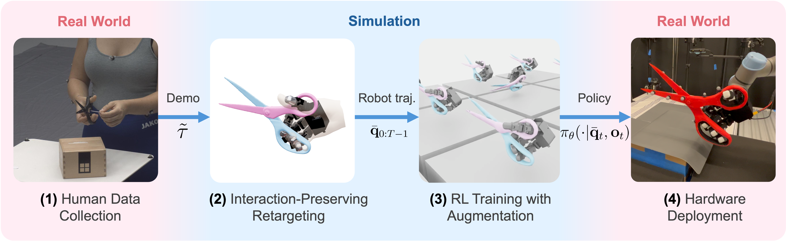

# REGRIND

[](https://docs.python.org/3/whatsnew/3.11.html)
[](https://docs.isaacsim.omniverse.nvidia.com/5.1.0/index.html)
[](https://isaac-sim.github.io/IsaacLab/main/index.html)

Implementation of ["A Minimalist Retargeting-Guided Reinforcement Learning Recipe for Dexterous Manipulation"](https://www.yunhaifeng.com/REGRIND/).



## Installation

First follow the [IsaacLab official instructions](https://isaac-sim.github.io/IsaacLab/main/source/setup/installation/binaries_installation.html) to install IsaacSim 5.1.0 and IsaacLab 2.3.0. 

Then set up the `regrind` conda environment with the following commands:

```bash
cd /path/to/IsaacLab
./isaaclab.sh --conda regrind

cd /path/to/regrind
conda activate regrind
isaaclab -i rsl_rl
python -m pip install -e source/regrind
source scripts/set_path.sh
```

## Retargeting

Note: The retargeted trajectories are also provided in this repository. You can directly 
[start training](#rl-training) without running retargeting.

### Dependencies

The retargeter relies on [Drake](https://drake.mit.edu/) (`pydrake`), which is **not** part of the
core install (so `import regrind` works without it). Install it into the `regrind` env:

```bash
conda activate regrind
python -m pip install -e "source/regrind[retargeting]"   # installs the `drake` extra
# or simply: python -m pip install drake
```

### License (Mosek)

The optimizer defaults to the [Mosek](https://www.mosek.com/) QP solver, which requires a license:

```bash
python -m pip install mosek
```

Mosek offers free [personal academic licenses](https://www.mosek.com/products/academic-licenses/)
and trial licenses. Download the license file and point Drake at it explicitly:

```bash
export MOSEKLM_LICENSE_FILE=/path/to/mosek.lic
```

(Drake also ships the license-free Clarabel solver; the retargeter exposes a `solver=` argument if
you prefer to use it instead of Mosek.)

### Running retargeting

Make sure the path environment variables are set (`source scripts/set_path.sh`) so demos, keypoints,
and assets resolve, then run:

```bash
python scripts/retarget_hand_object.py --robot {leaphand,wujihand} --object {scissors,screwdriver}
```

Revo2 uses 21 semantic points driven by a floating wrist and six independent
joint positions. Run a one-frame DexYCB check with the packaged tuna-can model
and object points as follows:

```bash
python scripts/retarget_hand_object.py \
    --robot revo2 \
    --object tuna_fish_can \
    --demo /path/to/dexycb_preprocessed.h5 \
    --demo-type dexycb \
    --single-frame 50 \
    --solver clarabel \
    --no-visualize \
    --out /tmp/revo2_frame_50.h5
```

Use `--object-model` and `--object-keypoints` to override the packaged object
geometry and `(N, 3)` surface points. DexYCB input supports
`human_hand_keypoints` / `mano_joint_coords`, separate object position and
quaternion datasets, or a combined seven-value object pose dataset; see
`python scripts/retarget_hand_object.py --help` for quaternion/layout options.

Omit `--single-frame` to process the complete DexYCB sequence. DexYCB keeps its
original frame count by default (`--interpolation-factor 1`), and every frame
is warm-started from the last successful solution:

```bash
python scripts/retarget_hand_object.py \
    --robot revo2 \
    --object tuna_fish_can \
    --demo /path/to/dexycb_preprocessed.h5 \
    --demo-type dexycb \
    --solver clarabel \
    --source-fps 30 \
    --no-visualize \
    --out /tmp/revo2_sequence.h5
```

The output may be HDF5 (`.h5`/`.hdf5`) or compressed NPZ (`.npz`). Alongside
the trajectories it stores per-frame `solver_success`, `objective_value`,
`joint_limit_violation`, `max_joint_limit_violation`, `warm_start_frame`, and
`failure_indices`. Failed robot frames contain NaNs rather than a copied prior
solution. Animate the kinematic result with:

```bash
python scripts/visualize_retargeted_sequence.py /tmp/revo2_sequence.h5
# optional export:
python scripts/visualize_retargeted_sequence.py /tmp/revo2_sequence.h5 \
    --save /tmp/revo2_sequence.mp4 --no-show
```

The trajectory fields follow the schema expected by `load_retargeted_traj` (keys `robot_pos`,
`robot_quat`, `robot_joints`, `object_pos`, `object_quat`, `object_joint`, `robot_keypoints`,
`mano_joint_coords`). Visualize / sanity-check it against an environment by overriding the
trajectory path:

```bash
python scripts/replay_retargeted_traj.py --task Regrind-LeapHand-Scissors-Play-v0 \
    --headless --video --num_envs 1 --retargeted_traj_path /path/to/out.h5
```

## RL training

### Exploring the environments

To list available tasks/environments:

```bash
python scripts/list_envs.py 
```

You can add `--suite [suite]` to only show tasks from a specified suite (robot), where `[suite]` 
can be either `LeapHand` or `WujiHand`.

(From now on, we will use `[task]` to denote the task name. Each task is named as 
`Regrind-[suite]-[object]-v0`, e.g., `Regrind-LeapHand-Scissors-v0`, 
`Regrind-WujiHand-Screwdriver-v0`, etc. The environments used for play / evaluation are named 
as `Regrind-[suite]-[object]-Play-v0`.)

To run a zero-action / random agent and visualize:

```bash
python scripts/zero_agent.py --task [task] --num_envs 16
python scripts/random_agent.py --task [task] --num_envs 16
```

### Training

```bash
python scripts/rsl_rl/train.py --task [task] --headless --num_envs 4096
```
To enable wandb logging, add `--logger wandb --log_project_name regrind`.  

### Evaluation

```bash
python scripts/rsl_rl/play.py --task [task] --headless --video
```

Note that we should use the play environments (with the suffix `-Play-v0`). 
Use `--checkpoint` to specify the checkpoint to evaluated. The latest checkpoint will be used if not specified.
When evaluating an intermediate checkpoint, use `--auto_gravity_from_ckpt` to infer the corresponding gravity since we perform gravity curriculum.
